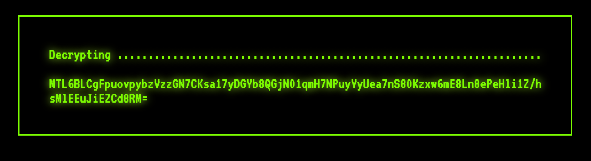
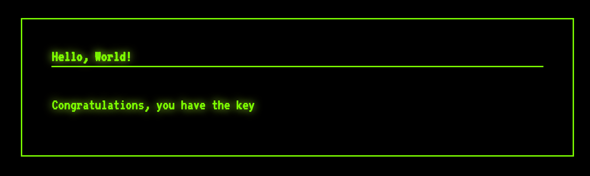

# plainsight

Encrypt files and make them accessible with a client-side decryption UI. 

**Read the [security notes](#security-notes)!**

**[See an example](https://alexkrolick.github.io/plainsight/?key=helloworld&token=opensesame&salt=F6zh2FiMANg)!**





## Usage

Assuming you are in the same directory as the scripts, have Node installed, and ran `npm install` (this is admittedly a clunky process):

### Encrypt a file

```shell
node ./encrypt.js # follow the prompts for filename and password
```

### Decrypt a file

```shell
node ./decrypt.js # follow prompts for filename and password
```
  
### Share a file

1. Encrypt a file using the [encrypt.js](encrypt.js) Node script. Use a long password.
1. Copy the JSON file output into the configuration object into a new key in [config.js](config.js):

  ```js
  var config = { 
    newKey: {
      // new config object here ...
    } 
  }
  ```
  
1. Remove the `salt` parameter from the config value. The value is base64-encoded so it can be provided in a URL later.
1. Open [index.html](index.html) in a web browser. Provide URL params for key, token (password), and salt:
  
  ```shell
  open ./index.html#key=helloworld&token=opensesame&salt=F6zh2FiMANg
  ```
  
1. Publish the files to a static webserver and give someone the decryption url


## Example
https://alexkrolick.github.io/plainsight#key=helloworld&token=opensesame&salt=F6zh2FiMANg

## Dependencies

- Encryption and decryption are performed using the Stanford Javascript Crypto Library: https://bitwiseshiftleft.github.io/sjcl/
- The command-line utilities require Node and a few packages from NPM. See [package.json](package.json) for details.

## Security Notes
- This is mostly a novelty UI and hasn't been validated significantly.
- Leaving encrypted files out in public may not be that good of an idea. A repeated password or brute force attack could result in the files being decrypted without your knowledge.
- Don't trust blindly in the package manager - audit the dependencies installed by NPM.
- Remove the Google Font from [index.html](index.html) if you are worried about 3rd parties potentially using that to snoop the page.
